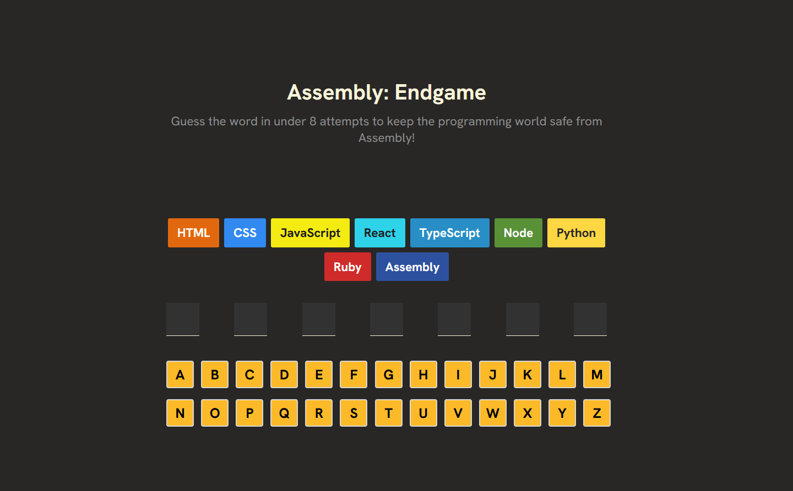

# 🕹️ Assembly: Endgame

**Assembly: Endgame** is a frontend word-guessing game built with React. Inspired by Hangman, the game challenges the user to guess an 8-letter programming-related word in under 8 incorrect attempts. Each wrong guess knocks out a programming language, until only Assembly remains.

## 🚀 Features

- ✅ Word selection from a curated list of programming terms
- 🎯 Letter guessing with instant feedback (green = correct, red = wrong)
- 🧠 Visual language elimination tracker
- 📢 Dynamic message system based on gameplay progress
- 🔁 Restartable game state with clean UX

## 🧱 Tech Stack

- React (Functional Components & Hooks)
- Custom Hooks (`useGameState`, `useWinCheck`, etc.)
- Modular file structure with UI and logic separation
- Vanilla CSS with responsive design

## 📂 Project Structure

```
src/
├── components/
│   ├── Game/              # Game layout components
│   └── UI/                # Visual components (Letters, Inputs, etc.)
├── hooks/                 # Custom logic (state, win check, etc.)
├── utils/                 # Static word lists, config data
├── styles/                # CSS styles
└── App.jsx
```

## 📸 Preview


