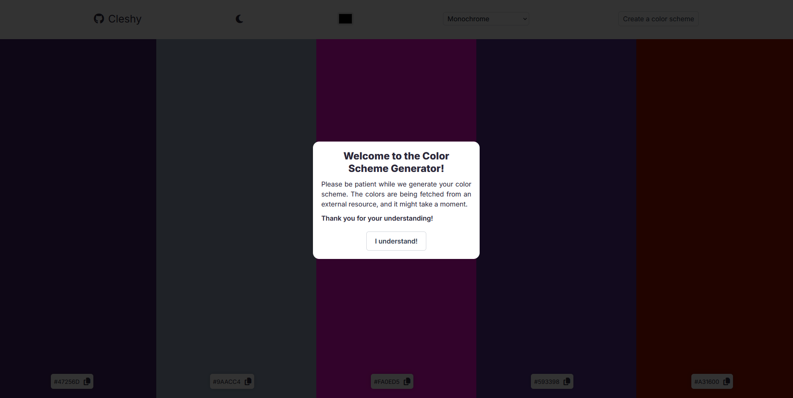

# Color Scheme Generator

The **Color Scheme Generator** is a simple web application that allows users to create beautiful color palettes based on a selected base color and color scheme. It is designed to be user-friendly and visually appealing, making it a great tool for designers, developers, and anyone who loves working with colors.

## Features

- **Base Color Selection**: Choose a base color using a color picker.
- **Color Scheme Options**: Select from various color schemes, such as Monochrome, Analogic, Complement, Triad, and more.
- **Generated Palettes**: View a palette of colors generated based on your selection.
- **Copy Colors**: Easily copy color codes to your clipboard with a single click.
- **Light/Dark Mode**: Toggle between light and dark themes for a personalized experience.

## How to Use

1. Select a base color using the color picker.
2. Choose a color scheme from the dropdown menu.
3. Click the "Create" button to generate your color palette.
4. Copy any color code by clicking on it.
5. Toggle between light and dark modes using the mode switcher.

## Screenshot

