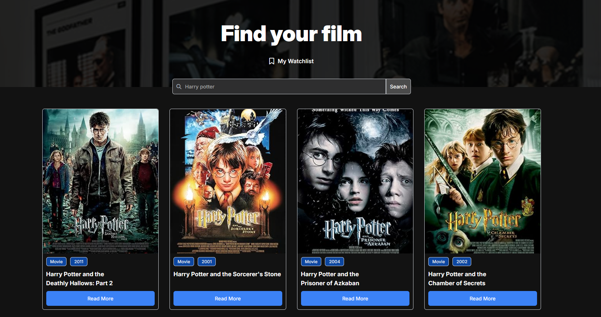

# Movie Watchlist

The **Movie Watchlist** is a simple web application that allows users to search for movies, view detailed information, and manage a personalized watchlist. It is designed to be user-friendly and visually appealing, making it a great tool for movie enthusiasts.

## Features

- **Search Movies**: Search for movies using the OMDB API.
- **Movie Details**: View detailed information about a selected movie, including its plot, genre, director, and more.
- **Add to Watchlist**: Save your favorite movies to a watchlist for easy access later.
- **Remove from Watchlist**: Manage your watchlist by removing movies you no longer want to keep.
- **Light/Dark Mode**: Toggle between light and dark themes for a personalized experience.

## How to Use

1. Use the search bar to find movies by title.
2. Click on a movie to view its detailed information.
3. Add a movie to your watchlist by clicking the "Watchlist" button.
4. Manage your watchlist by navigating to the watchlist page and removing movies as needed.
5. Toggle between light and dark modes using the mode switcher.

## Screenshot

